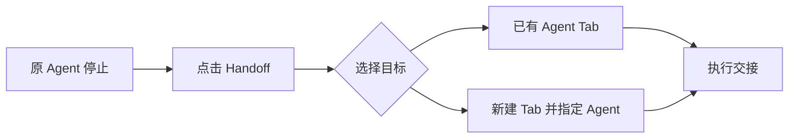
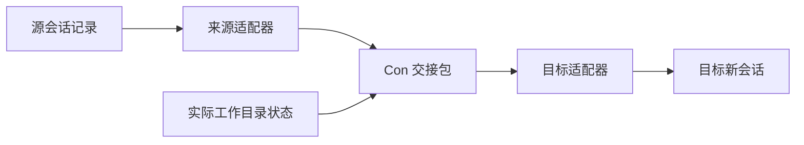

# Proposal: Agent Handoff — 在 Con 中接续跨 Agent 任务

状态：原始功能提案 · 日期：2026-09-22。

实施更新：2026-09-25 起适配范围收缩为 Codex、Cursor、Kimi
（OpenCode、Pi、Gemini、GitHub Copilot、Grok 已按用户产品决策移除）；
2026-09-23 的 Tab 路由 ADR 取代下文的旧目标预览流程。真实 Codex→Cursor 接续
已通过独立 TTY 验收；新 Con 窗口交互仍待手动验收。用法、已实现范围与限制见
[实施记录](../impl/agent-session-handoff-plan.md)。

上游英文提案：[Issue #381](https://github.com/nowledge-co/con-terminal/issues/381)。

## 提案摘要

为 Con 增加 `Handoff Agent…`：用户选定另一个编码 Agent 后，Con 将当前任务的目标、
关键决策、进展和代码状态整理成交接包，在同一工作目录启动目标 Agent 的新会话，继续工作。

建议先交付 **macOS 本地 Codex CLI → Cursor CLI**，保留双方原生终端体验。
随后通过独立适配器扩展 OpenCode、Claude Code 等 Agent。

本提案承诺的是可追溯的任务交接。目标 Agent 使用自己的会话、模型和权限；
不会无损继承源 Agent 的全部内部状态。

## 要解决的问题

用户可能因为额度耗尽、模型能力差异或希望换一个 Agent 继续排障而切换工具。
目前需要手动复制聊天、解释修改进度，并提醒新 Agent 哪些尝试已经失败。
重要约束容易遗漏，刚完成的工作也可能被重复执行。

Con 已承载这些 Agent 的终端、工作目录和代码现场。
把交接做成终端内操作，可以让用户保留当前工作进度，减少重新说明任务的成本。

典型场景：Codex 已完成部分修复，留下未提交文件和一个失败测试。用户选择 Cursor，
Cursor 能了解修复目标、已做的尝试与剩余失败，直接继续验证，而非重新开始分析。

## 用户体验

正常路径只有目标选择与简短预览。预览展示“正在做什么 / 已完成什么 / 接下来做什么”，
用户可编辑目标或展开待传递内容。技术 ID 和协议细节放在详情中。

源 Agent 仍在执行时，提供“等待完成 / 请求停止 / 取消”；只有已证明的控制通道才能请求停止。
无法确定具体会话或运行状态时，让用户选择会话并确认停止。不能仅凭终端 Logo 或输出静止自动接管。

目标在新 surface 中启动，保留原终端。Con 分别显示“已发送”和“已接续”；
若无法可靠确认目标已接收，只显示前者，并提供确认或恢复操作。

## 首版范围

| 包含                                   | 后续独立评估                                |
| -------------------------------------- | ------------------------------------------- |
| macOS、本机 Git 项目、同一 worktree    | Windows/Linux、SSH、跨机器或跨 worktree     |
| Codex CLI → Cursor CLI                 | 其他方向和更多 Agent                        |
| 准确会话绑定、预览、交接包、新目标会话 | 双向实时同步、多 Agent 同时写入             |
| 保留 staged、unstaged、untracked 文件  | 自动提交、迁移 patch、回滚代码              |
| 保留原生 TUI 与各自权限流程            | Con 自绘所有 Agent 的协议聊天界面           |
| 可取消、失败恢复、覆盖范围说明         | 私有 session 数据库改写、隐藏推理或授权迁移 |

能力不满足时提供手动交接指令，不把该路径标记为自动接续成功。

## 方案

采用 **来源适配器 → 统一交接包 → 目标适配器**。增加一个 Agent 时分别实现读取与接收，
避免为每对 Agent 编写专用转换器。

交接包包含用户目标与纠正、约束、关键决策、完成项、剩余任务、失败尝试、测试证据，
以及源会话标识和工作区快照。历史保留出处与缺失标记；代码以磁盘实际文件为准。

默认确定性提取必要上下文，不要求用户另配一个摘要模型。可选模型摘要单独标明调用与费用来源。
交接包存于 Con 私有应用目录，只把筛选后的可读内容暂存到项目内，供目标在其权限范围内读取。
目标仍须核对实际文件，不能把旧测试结果当作当前代码已通过测试。

首版用 Codex 的历史读取能力导出；Cursor 通过新终端中的可见启动助手创建并绑定会话，
接收读取交接包的短指令。具体 create-chat、resume 和初始提示的组合必须先通过验证。
完整对话不放命令行参数，也不通过云端分享链接中转。

职责遵循现有 crate 边界：con-agent 管适配与通用类型，con-core 管事务和存储，
con-app 管终端与 UI，con-cli 提供启动助手和自动化入口。
外部 Agent 是独立 runtime，不作为内置 Rig 的另一个模型供应商。

## 可行性与支持策略

本次前置调研已完成以下核实；它们证明接入基础，尚不能证明完整交接成功：

- 本机 Codex App Server 的初始化、会话列表和历史读取成功。
- Cursor、Kimi、Gemini、Copilot 的 ACP 初始化成功；未发送模型 prompt。
- OpenCode、Pi 的本机命令和文档已核查；其他 Agent 依据官方资料评估。
- Con 已有 surface 控制，AgentCliTurnTool 当前只支持 Codex、Claude、OpenCode，Cursor 仍需接入。

| 阶段     | Agent                        | 建议                                             |
| -------- | ---------------------------- | ------------------------------------------------ |
| 首版     | Codex → Cursor               | 验证真实接续与失败恢复                           |
| 优先扩展 | OpenCode、Claude Code        | 历史读取与接收机制较明确                         |
| 下一批   | Kimi、Pi                     | 先处理历史加载副作用、排队输入和停止语义         |
| 后续     | Gemini、Copilot、Qwen、Goose | 验证版本化读取、导出及 TUI 组合                  |
| 专项     | Amp、Droid                   | Amp 区分远程执行；Droid 既有完整历史导出尚未证实 |

每个 Agent 分别标注“可作为来源”“可接收”“已验证版本”。协议握手成功、支持 resume、
支持导出，都不能单独作为完整兼容的标准。详细证据见 [支持矩阵](../study/agent-handoff-compatibility.md)。

## 可靠性边界

| 风险                          | 处理原则                                           |
| ----------------------------- | -------------------------------------------------- |
| 同目录存在多个会话            | 精确 ID 绑定；有歧义时用户选择，不默认最近一个     |
| 源 Agent 或其他进程继续改文件 | 停止源任务，采集及发送前核对快照；无法确认时仅导出 |
| 丢失约束、摘要失真            | 保留关键用户原文和来源；预览显示覆盖范围及缺失     |
| 创建或发送后崩溃              | 持久化 job/目标 ID；结果未知时核对，不盲目再次发送 |
| 权限与敏感内容跨工具传播      | 过滤内容、预览传递范围；不迁移凭据或自动批准权限   |
| 接口升级                      | 能力探测和版本矩阵；未知版本降级，不猜测兼容       |

Con 的单写入约束只能约束自己管理的流程，不能锁住所有外部编辑器或后台进程。
目标开始修改后，回到源 Agent 也需要重新核对上下文；保留源会话不等于可以回滚工作现场。

## 替代方案与取舍

| 方案                        | 取舍                                                  |
| --------------------------- | ----------------------------------------------------- |
| 复制终端滚屏                | 简单，但历史不完整、角色不清楚；保留为手动辅助        |
| 改写目标原生 session 文件   | 私有格式和语义不稳定，不采用                          |
| 首版统一托管所有 Agent 协议 | 控制更准确，但需自建完整聊天、工具和权限 UI，范围过大 |
| 共享记忆或 MCP              | 可补充长期知识，不能代替准确会话和代码状态的交接      |
| 通用交接包与两端适配器      | 采用；可逐步扩展，代价是显式管理上下文损失与版本差异  |

## 交付与验收

| 里程碑       | 交付物                                 | 通过条件                                              |
| ------------ | -------------------------------------- | ----------------------------------------------------- |
| M0：组合验证 | 临时仓库中的 Codex→Cursor 可行性记录   | 精确绑定、创建/恢复、读取包、停止及接收确认有明确结果 |
| M1：交接核心 | 适配器、包、快照、事务、恢复           | 错误会话、重复请求、文件变化、崩溃恢复测试通过        |
| M2：Con 集成 | 菜单入口、预览、新 surface、状态和取消 | 原生交互可见，错误可恢复，权限流程保持有效            |
| M3：首版验收 | 回归报告与真实任务接续记录             | 代码检查通过，关键端到端场景全部通过                  |

核心验收：Codex 在测试仓库完成部分修复，保留 staged/unstaged/untracked 改动和失败测试；
交接后 Cursor 正确复述剩余目标、保留已有文件，完成后续修复并实际通过测试。

同时必须通过：同目录多会话不串线、文件中途变化触发重建、重复点击不重复交接、
投递结果未知不自动重发、取消后明确谁仍在运行、认证失败不丢原任务。
记录导出耗时、交接大小、完成率及手动介入原因；M0 后再根据测量确定性能目标和工程排期。

M0 若无法可靠完成自动接续，首版降为“导出交接包 + 打开目标 + 手动投递”，
明确展示限制，并重新评审自动接续范围；不以修改私有数据库绕过门槛。

## 建议评审决定

建议接受该功能方向，先进入 M0 组合验证；首版限定 Codex→Cursor、macOS、本地同一 worktree。
统一交接包与方向性能力矩阵作为扩展基础，是否进入 M1–M3 由 M0 结果决定。
此次提案不代表已批准实现、发布或扩展全部 Agent。

## 配套材料

- [可行性与设计决策](agent-session-handoff.md)
- [架构契约](agent-session-handoff-contract.md)
- [实施计划与验收细节](../impl/agent-session-handoff-plan.md)
- [其他 Agent 兼容性调研与官方来源](../study/agent-handoff-compatibility.md)
