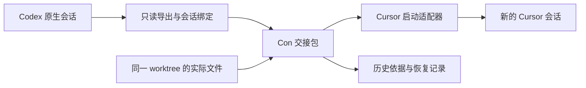

# 跨 Agent 会话交接：可行性与设计决策

## ADR-agent-handoff-tab-routing-2026-09-23（取代旧窗口流程）

### 修正：先绑定运行中的来源（2026-09-23）

来源识别的进一步修正：目录筛选只得到候选，不是当前 TUI 的身份。本机 Codex CLI `0.155.1` 在运行时为**当前正在写入的 thread** 持有 `CODEX_HOME/sessions/**/rollout-*-<thread-id>.jsonl` 文件描述符，并持有 `CODEX_HOME/thread-writer-locks/<thread-id>.lock` 锁。resume 切换的过渡期进程会同时持有多把锁（旧 thread + 新 thread），只凭锁无法区分当前会话；rollout fd 始终唯一指向 TUI 正在写入的 thread，因此 rollout 是主证据、锁是回退。Con 直接检测当前窗口的前台进程组：先用 libproc（`proc_pidinfo`/`proc_pidfdinfo`，微秒级、无子进程超时）查询 leader PID 打开的文件；leader 无证据时（wrapper 启动场景）扫描同组所有进程，lsof 仅作最后回退。其余 3 种本机 Agent 使用原生 CLI 明确的 session ID 启动参数，leader argv 无明确 ID 时同样扫描同组进程的 argv；Kimi 欢迎界面的 `Session:` ID 也可提供证据。只有唯一 ID 存在于该 Agent 同 cwd 的发现结果中，才自动选中并免去手选。启动参数和 Kimi 欢迎界面仅证明初始 ID，TUI 内切换会话后无法继续证明当前 ID，因此仍需用户勾选确认；Codex rollout/锁证据无需此确认。执行准备前及投递前重新验证进程证据。无证据、冲突、ID 不在发现列表或进程变更时不按更新时间推断。已安装 Agent 清单探测结果按 5 分钟 TTL 缓存，避免每次打开弹窗重复探测 4 个 CLI。

Handoff 必须从**正在运行 Agent 的终端 Tab**发起。点击时先核验本地前台 Agent、绑定 Tab/terminal/前台进程组和 cwd，再读取该 Agent 在该目录的原生会话。唯一候选可自动选定，但仍显示 ID 并要求用户确认它是当前会话；多候选必须在目标选择框内让用户明确指定当前原生会话，不能猜最近一条。随后弹出已有 Agent Tab／新建 Tab 选项。执行前再次核验绑定的进程没有更换；源停止确认已按 2026-09-24 用户决策移除（见架构契约“源停止确认的移除”）。退出 TUI 后失去即时身份绑定，不能作为新交接的前置要求。

这取代本节下方“源 Agent 停止后点击”的先前表述。替代的“先退出进程再按 cwd 查询最近会话”会把其他 Tab 或旧会话误认为来源；风险是部分 Agent 无法从终端直接暴露原生 ID，此时明确选择并保留身份不确定提示，不伪装为自动识别。

决定：从正在运行的源 Agent Tab 点击 Handoff，先绑定来源再出现目标选择框。目标是已运行受支持 Agent 的其他 Tab，或“新建 Tab”并选择本机已安装 Agent。选择后执行交接；源 Tab 保留且不会自动恢复。仅当同一工作目录存在多个可导出来源会话、无法精确绑定时，选择框额外要求指定原生来源会话，绝不默认取最近一个。工作目录、来源身份及目标进程在真正发送前再次核验。

已有 Tab 路径向该 Tab 的原生 Agent 输入投递交接指令，不启动第二个 Agent；新建路径创建真正的 Con Tab，在其中可见地启动指定 Agent。投递状态先持久化为不确定，不能因 PTY 写入就声称目标已接续；只有可观察回执或用户确认后才标记接续完成。未知状态不自动重发。

旧版“选来源 → 预览 → Open Agent → 手动复制”不再是主交互。交接执行后的状态入口仍可查看交接内容与证据；CLI 的显式 prepare/start 操作维持兼容。

替代方案：沿用同 Pane 新 surface 无法满足用户的 Tab 路由；仅复用旧预览窗口仍让用户重复选择已有上下文；对所有现有 Tab 无条件发送会误投 Shell 或已退出的 Agent。因此采用目标 Tab 选择和发送前的活性核验。

风险：来源 TUI 退出后终端可能丢失 Agent 名称；必须以会话导出和用户在歧义时的精确选择补足，不以图标猜测。目标 TUI 的输入状态无法跨产品统一证明；写入前保存不确定状态，失败时保留原 Tab 和交接包供人工核对，禁止自动重试。

状态：macOS 本机 3 个 Agent 的适配已实现（2026-09-25 起收缩为 Codex、Cursor、Kimi，见文末“收缩 ADR”）；Con 窗口完整交互及新增组合的真实接续待验收。日期：2026-09-22。
当前范围以文末“扩展 ADR”“收缩 ADR”及架构契约为准；以下 MVP 与可行性研究保留历史决策依据。

## 实施 ADR：保守的原生 TUI 交接

ADR-agent-session-handoff-mvp-2026-09-22 取代下文初始方案中尚未冻结的实现细节。
首版使用明确选择的 Codex 会话、确定性历史提取、持久化 job 状态（worktree 租约已按文末 round7 ADR 移除），以及新 Cursor
原生 TUI。源停止和目标接续由用户分别确认；不使用屏幕稳定作为 ACK。
仅对实测 Cursor `2026.09.18-9a7762b` 自动传入首次提示；其他兼容版本手动粘贴。
实际字段和状态以 [架构契约](agent-session-handoff-contract.md) 为准，
操作方式和验收证据见 [实施记录](../impl/agent-session-handoff-plan.md)。

以下可行性调研保留为设计背景；其“尚未验证”描述指实施前的调研阶段。

功能评审先读 [Agent Handoff Proposal](agent-handoff-proposal.md)。

本文是设计入口，配套 [架构契约](agent-session-handoff-contract.md) 与
[实施和验收计划](../impl/agent-session-handoff-plan.md)。

扩展阅读：[其他 10 个 Agent 的方向性支持矩阵与探测记录](../study/agent-handoff-compatibility.md)。
调研矩阵是实施前证据；本机已实现范围见文末扩展 ADR，代码完成不等于真实接续验收通过。

## 结论

**可以实现 Codex CLI → Cursor CLI 的任务上下文交接。** Con 读取源会话的可导出记录，
保存带来源的交接包，在同一工作目录启动目标 Agent 的新会话，让它继续任务。

可行性证据包括仓库已有终端控制能力、本机 CLI 的只读协议探测和官方文档。
尚未验证完整交接、Cursor 原生 TUI 恢复、登录后的推理与取消流程，因此不能称为已完成原型。

| 能力                                     | 结论                   | 边界                                             |
| ---------------------------------------- | ---------------------- | ------------------------------------------------ |
| 传递目标、约束、决策、待办、测试记录     | 可实现                 | 摘要可能有损，保留来源与缺失标记                 |
| 延续当前代码修改                         | 可实现                 | 第一版复用同一 worktree，不复制或重置代码        |
| 为目标创建独立会话                       | 接口具备，需端到端验证 | 新 session ID，与源会话建立交接关联              |
| 无损迁移全部内部状态                     | 不承诺                 | 不迁移隐藏推理、模型缓存、系统提示、凭据、授权   |
| 任意手动启动的 Agent 自动接管            | 有条件                 | 必须确认准确会话及停止写入，不能靠目录或 Logo 猜 |
| Cursor 桌面 IDE 中直接打开等价会话       | 不在第一版             | CLI/ACP 的存在不等于 IDE 导入接口已验证          |
| 双向持续同步、远程 SSH、跨 worktree 迁移 | 不在第一版             | 分别需要历史导出、远程身份和文件迁移契约         |

## ADR：采用 Con 持有的交接包

决策编号：ADR-agent-session-handoff-2026-09-22。

没有旧的专用交接 ADR 被取代。本文补充
[Agent Runtime Control Plane](../impl/agent-runtime-control-plane.md)，继续保留其
“观察不等于控制”“地址不等于身份”“未证明 attachment 就不能声称原生控制”的约束。
设计获批并实现后，才在已证明的 attachment 上扩展原生会话读取；不把该能力泛化到所有终端。

Con 管理独立的 HandoffJob，而非把外部 Agent 混入内置 Rig 的 Model Provider。
不同 Agent 拥有自己的认证、会话、交互和工具执行语义。

交接的是语义上下文；源记录作为历史证据传入，不伪造成目标 Agent 原生 assistant/tool 消息。
代码以磁盘实际状态为准；交接包里的 Git 信息用于校验，不用于自动回滚。

## 已核实的证据

### 仓库基础与缺口

| 位置                                                                          | 当前事实                                                             | 设计影响                                                    |
| ----------------------------------------------------------------------------- | -------------------------------------------------------------------- | ----------------------------------------------------------- |
| [tools.rs](../../crates/con-agent/src/tools.rs) 的 `AgentCliTurnTool`         | 支持发送提示并等待屏幕稳定；名称校验只接受 codex/claude/opencode     | 不能宣称现有工具已支持 Cursor，不能把屏幕稳定当作 turn 完成 |
| [tab_presentation.rs](../../crates/con-app/src/workspace/tab_presentation.rs) | 有 Cursor 等品牌识别与图标映射                                       | 品牌识别不证明 native session ID                            |
| [session.rs](../../crates/con-core/src/session.rs) 的 `AgentRoutingState`     | 保存内置 provider/model overrides                                    | 不是外部 Agent 原生会话绑定，禁止复用为该含义               |
| [Pane Surfaces](../impl/pane-surfaces.md)                                     | 有 create/read/send/focus 等控制；surface ID 仅在 tab 内生命周期稳定 | 使用 tab、surface、generation 组合定位，重启后重验证        |
| [con-paths](../../crates/con-paths/src/lib.rs)                                | 提供平台一致的 app_data_dir                                          | 交接记录放应用数据目录，避开 Windows 的 CON 保留名          |

### 本机只读探测

2026-09-22，在本仓库执行，输出仅保留能力和计数，不导出对话正文：

| 对象                        | 实测                                                                                                                        |
| --------------------------- | --------------------------------------------------------------------------------------------------------------------------- |
| Codex `0.155.1`             | `app-server` 的 initialize、按 cwd 限定的 thread/list、thread/read(includeTurns=true) 均成功；抽取的一个会话返回 4 个 turns |
| Cursor `2026.09.18-9a7762b` | cursor-agent acp 的 initialize 成功，返回 protocolVersion=1、loadSession=true、session list 能力                            |
| Cursor 提示能力             | embeddedContext=false、image=true、audio=false；第一版采用纯文本提示，不依赖嵌入资源支持                                    |
| 可执行文件                  | 本机 PATH 中 agent 实际位于 Grok 目录；Cursor 使用独立的 cursor-agent 路径                                                  |

没有创建 Cursor 会话、发送 prompt、修改认证或恢复任何源会话。探测结束关闭本次启动的协议进程。
新启动的 Codex app-server 能读取记录，不代表它掌握另一个 TUI 进程的实时活动或可中断其 turn。

2026-09-25 修订：Codex 0.157 的 TUI 与 managed app-server daemon 分体，
rollout/writer lock 可由不同 pgid 的 daemon 持有。discover 仍用独立只读
`thread/list`/`thread/read`；bind 则从前台 TUI 的 localhost ESTABLISHED TCP
完整反向连接定位并校验 app-server 对端，合并原进程组证据，冲突拒绝。
libproc 无证据必须继续 lsof；失败不得当作无锁。只有成功但无证据时，
才允许同 cwd、updatedAt 唯一的 recent 建议与用户勾选确认，不能冒充实时绑定。
“当前 TUI thread”只读 API 仍待上游确认；不臆造 `thread/current`。

### 官方支持范围

- Codex App Server 提供 thread/list、thread/read，读取可不恢复会话；能力与字段随版本探测。
  [OpenAI 官方文档](https://learn.chatgpt.com/docs/app-server)。
- Cursor ACP 提供初始化、会话创建/加载、提示、更新及权限请求；ACP 面向自定义客户端。
  [Cursor ACP](https://cursor.com/docs/cli/acp)。
- Cursor CLI 提供 create-chat、指定 ID 的 resume 和初始 prompt。
  [Cursor 参数](https://cursor.com/docs/cli/reference/parameters)。

接口文档证明组成能力，不能代替本项目的组合验收。以上版本为探测基线，不是最低支持版本承诺。

## 第一版产品流程

入口：终端上下文菜单或命令面板的 `Handoff Agent…`，选择 Cursor。
默认范围为本机 macOS、Git 工作目录、Codex CLI → Cursor CLI。

1. Con 检查源 surface、准确 native session、Cursor 可执行文件和项目目录。
2. 如果源仍工作，呈现“等待完成 / 请求停止 / 取消”；只有具备原生控制 attachment 才能请求停止。
   手动运行且活动状态未知时，提示用户先停止源操作并确认；不自动发送 Ctrl-C 猜测。
3. 固定导出截止点，展示简短交接预览。已绑定、已空闲、能力通过的会话走快捷路径。
4. 保存交接包，在同一 pane 新建 Cursor surface；旧 surface 保留。
5. 目标先读取交接包、核对目录和文件，报告目标与下一步，再继续原任务。
6. 显示“已发送”与“已接续”两种状态；发送字节成功不能显示已接续。

使用 gpui-component Select/Button；系统字体、Phosphor 图标、无边框阴影。
主界面只显示目标 Agent、当前状态和必要操作；协议 ID 留在详情中。
源会话歧义、需要登录、投递不确定等异常保持可见，不隐藏为后台重试。

## 两条接入路径

### 第一版：原生终端交接

Codex App Server 负责只读历史导出，Cursor 保持原生 TUI。
由新 surface 中可见的启动助手执行已验证的 Cursor create-chat，持久化返回的会话 ID，
再以准确 ID、相同 cwd 启动 resume，并附一个短的交接读取指令。
助手是未来 con-cli 的实现能力，当前仓库尚不存在。

完整上下文不放命令行参数；短指令仅携带随机交接 ID、交接文件位置和读取要求。
项目内暂存只包含筛选后的可读交接内容，具体读权限与清理规则见契约。
创建会话、启动、读取、登录提示都在目标 surface 可见，禁止悄悄运行可写的 headless Agent。

create-chat → resume → 初始 prompt 的组合及项目内文件访问必须先做能力 spike。
若版本不支持组合或无法确认投递结果，降级为用户在已打开 Cursor 会话中粘贴交接指令；
不降级为伪造 Cursor 数据库或不断敲 Enter。

### 后续：协议托管会话

Con 直接作为 Codex App Server / Cursor ACP 客户端，精确管理 session ID、turn 事件和权限。
这种模式需要 Con 自己呈现聊天、工具执行、取消与权限选项；ACP 输出不是终端 TUI。
只有这些交互被实现且可见后，才能启用会修改代码的协议任务。
协议模式与原生 TUI 之间能否恢复同一个 session 仍是单独的兼容性验收项。

## 替代方案

| 方案                          | 优点               | 代价与决定                                                       |
| ----------------------------- | ------------------ | ---------------------------------------------------------------- |
| 复制全部屏幕回滚              | 接入简单           | 丢失滚屏前内容和角色信息，混入控制字符；仅作注明缺失的手动辅助   |
| 直接改写目标会话数据库        | 看似无缝           | 私有格式、版本升级与工具角色不兼容；不采用                       |
| 所有 Agent 从首版起都托管协议 | 身份和事件最可靠   | UI、权限、工具可见性范围过大；后续阶段                           |
| 通用交接包 + 两端适配器       | 可追溯、可逐个接入 | 摘要有损，需版本矩阵；采用                                       |
| 只用共享记忆/MCP              | 适合长期知识       | 无法单独证明正在交接哪轮会话及哪份代码；可辅助，不作交接事务权威 |

## 风险与上线条件

- 同目录多个会话：精确绑定或显式选择，不自动选最近一条。
- 文件继续变化：导出后和发送前重新比较快照；不一致则重建，不套用旧摘要。
- Con 不阻止多个 Agent、编辑器或后台进程并发修改文件；快照只保护投递前一致性。
- 历史包含敏感内容或不可信指令：筛选后才传递，源文本标为历史数据，目标使用自己的权限配置。
- 摘要失真或上文已压缩：保留出处、覆盖范围和缺失项；无法恢复的内容明确告知。
- 创建/发送结果不明：保留 Unknown 状态并核对，不承诺跨进程 exactly-once。

上线须通过配套计划的两道门：代码与契约回归、真实 Codex→Cursor 接续。
特别验收未提交改动、失败测试、多个同目录会话、取消、崩溃后恢复及不重复投递。

## 调研来源说明

本次 Nowledge MCP 检索：query=`con-terminal 跨 Agent session handoff 原生会话`，
mode=默认 normal（响应 retrieval_mode=strict），scope=default，无额外过滤，limit=1。
rank=1，Memory ID=`1a0769d5-8454-4e3d-9a92-3384793cf8b4`，
标题“con-terminal 按 agent 区分的路由与通知能力评估”，score=0.7994052567131241。
它提供历史探索线索；关于路由类型的含义以本次源代码核查为准。
未展示记忆图谱，因为未能证明图谱端与检索具有相同的空间权限约束。

## 扩展 ADR：本机已安装 Agent（2026-09-22）

ADR-agent-handoff-local-adapters-2026-09-22 部分取代 MVP 的 Codex-only 来源和 Cursor-only 目标。
本批（历史）明确包含当时在本机发现的 Codex、Cursor、OpenCode、Kimi、Pi、Gemini、Copilot、Grok、DimAgent（已移除；历史）；
2026-09-25 起收缩为 Codex、Cursor、Kimi，见文末“收缩 ADR”。
保留同机同 worktree、原生 TUI、不可变预览、版本化状态、无不确定重放和独立权限。
使用来源 reader → 统一包 → 目标 launcher 的组合，避免实现 N×N 转换器。

替代方案：只扩展目标启动会使已有 Agent 任务无法交出；直接读任意数据库缺乏稳定格式；
仅使用 ACP 无法覆盖无 list 或有冷加载副作用的产品。本批优先原生命令导出或已安装版本的
有界只读文本存储；需要 ACP 历史回放的来源只做只读回放，拒绝所有工具/权限请求。
来源发现不执行推理、不选“最近会话”、不导出全局日志或使用分享上传。

目标如支持指定新 ID 则预分配，支持 create-chat 则先创建。不能在原生 TUI 启动前获得 ID 的
目标保留 native ID 未知，以独立 handoff UUID 关联启动，绝不伪造原生 ID；仍禁止重试。
新适配器的自动投递资格保持未验证，保留可见的手动首次投递与明确回执。
用户要求全部实现后统一验证，本批实施期间不运行回归或真实模型接续。

本机实现补充：DimAgent（已移除；历史） 0.3.26 的原生 export 会加载会话，繁忙时还可能自动 fork。
因此采用带版本/schema 门槛的数据库字段白名单读取：有界复制 DB/WAL 到私有临时目录，
核对前后指纹后只读查询副本，原库不交给 SQLite 打开，避免修改源会话或 WAL sidecar。
Kimi 2.0.1 采用安装源码确认的 state/wire 文本读取，不调用包含全局日志的 ZIP 导出。

## 历史收缩 ADR：四个本机 Agent（2026-09-24，已被三 Agent 范围取代）

ADR-agent-handoff-scope-reduction-2026-09-24 取代扩展 ADR 中“包含九个本机 Agent”的范围，
并按用户产品决策移除 OpenCode、Pi、Gemini、GitHub Copilot、Grok：

- 来源侧：删除这 5 个产品的 reader 模块与 `AgentKind` 变体；来源发现、导出与
  `handoff sources --agent` 只接受 Codex、Cursor、Kimi、DimAgent（已移除；历史）。
- 目标侧：删除这 5 个产品的 help/version 探测、argv 构建、预分配 UUID 与候选模型
  探测分支；`handoff agents` 与目标选择只列出保留的 4 种。
- 进程绑定：`agent_from_executable` 与会话 ID 参数表同步收缩；其余机制
  （rollout 证据、Kimi 欢迎界面、精确匹配）不变。
- 兼容性：旧 job 记录引用被移除的 Agent 时不可反序列化，按“不可读取记录”保守保留，
  详见 [架构契约](agent-session-handoff-contract.md) 的“支持范围的收缩”一节。

保留的四种各自保留原有边界：Codex app-server 只读导出；Cursor ACP 只读回放 +
create-chat/resume；Kimi state/wire 文本读取；DimAgent（已移除；历史） 版本限定的 SQLite 副本读取。
重新支持其他 Agent 需要恢复适配并按兼容性调研的门槛重新验收。

## 移除发送前预览确认页（2026-09-24，用户产品决策）

ADR-agent-handoff-inline-send-2026-09-24 取代面板此前的
「选择 → **Prepare preview** → REVIEW & SEND 复核页 → Send handoff」流程。
按用户产品决策，REVIEW & SEND 复核页已移除：主表单的 **Send handoff** 一次点击
即 prepare 并直接进入路由投递，不再需要第二次确认，也没有 Discard。

- **复核材料后置。** `context.md` 与 `evidence.json` 改由任务卡片的
  “View handoff context” / “View evidence” 查看，发送前不再内嵌上下文摘录。
- **校验不减。** prepare 与投递之间保留全部完整性门槛：来源会话重绑、工作树快照
  校验、历史摘要核对、模型值校验、bundle 完整性读取；任一失败即取消 Prepared
  任务并报错，不会因跳过复核页而放宽。
- **确认语义不变。** Send click 仍是 [架构契约](agent-session-handoff-contract.md)
  “投递确认语义”中定义的最终确认；手动投递的 “I sent the instruction”、
  投递后的状态机不变；租约已由文末 round7 ADR 移除。
- **替代方案**：保留复核页、或把复核页折叠成按钮旁的可展开详情——被否，因为
  用户明确要求少一步确认；可展开详情仍会把发送拆成两次操作。

## 收缩 ADR：仅保留三个 Agent（2026-09-25）

取代上述四 Agent 范围：当前来源和目标仅支持 Codex、Cursor、Kimi；
DimAgent 已移除，包含 reader、进程映射、能力探测、启动和 UI 选项。
旧持久化名称读取为 Unknown，保留 job、拒绝启动且不自动取消，不阻塞新 prepare；
用户显式取消，已启动任务另须确认停止。详见当前架构契约。

## Round7 ADR：独立 job，移除 worktree 租约（2026-09-25）

用户裁定租约“太重”，推翻此前保留建议。同 worktree 可并行多个独立 job，每次 Send 新建，
revision 和状态机仅保护单 job 不重放。旧非终态、Unknown 或 corrupt 记录不挡 prepare。
Existing Tab 同时只有一个 Delivering/LaunchPending job；route 的检查和 Delivering 写入在
服务层同一个 store 锁内完成。该 guard 防投递期间双写 PTY，不等待目标 turn 完成。
保留快照漂移拒绝、回执、launch.lock、7 天终态清理和 job 级 Abandon/ConfirmStopped。
接受不同目标并行写文件、失败任务的进程仍存活、同 Tab 已结束投递后再次 Send 的风险。
详见 [契约](agent-session-handoff-contract.md) 与 [实施记录](../impl/agent-session-handoff-plan.md)。
