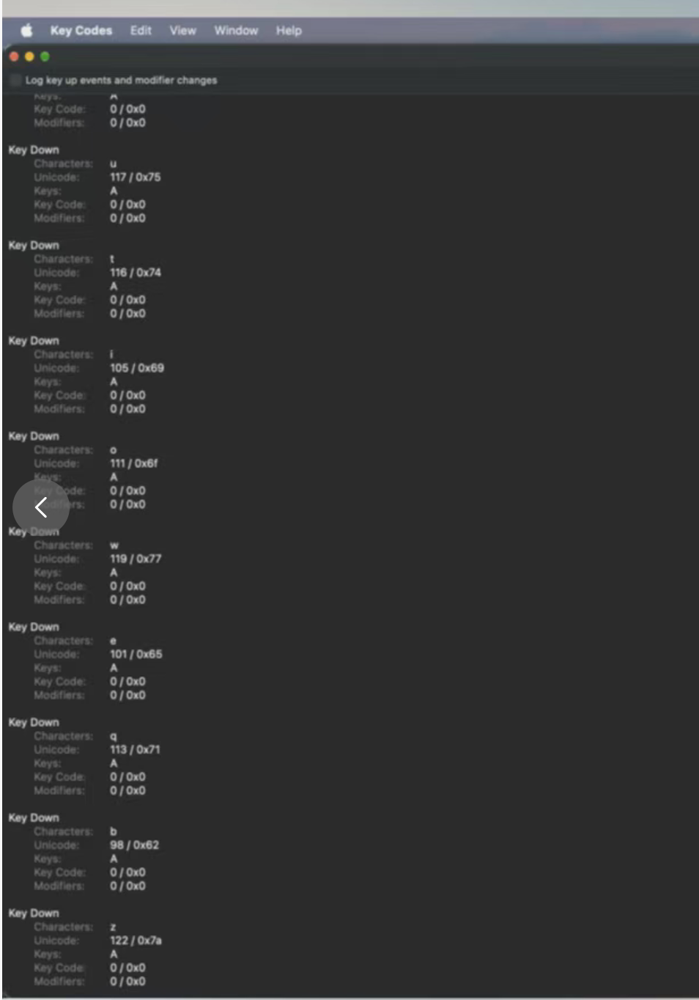

# macOS remote Unicode input was replaced by A

## What happened

Typing through vivo remote control from a tablet produced repeated `a` characters
in Con's terminal pane. The bottom command/AI input accepted the intended text,
and other terminal applications on the controlled Mac worked.

The user's Key Codes capture shows different characters, including `u`, `t`,
`i`, `b`, and `z`, with their correct Unicode values, but every event carries
virtual keycode `0` and no modifiers. This is not a missing keycode: `0` is the
valid macOS A keycode, used here as a placeholder for injected text.



## Root cause

The pinned `gpui-pre-macos 0.3.7` reconstructs printable `Keystroke::key_char`
from the virtual keycode and keyboard layout in `parse_keystroke`. It does not
preserve the Unicode payload from `NSEvent.characters` in that field. With an
ABC layout, the placeholder keycode is therefore translated to `a`.

Con forwards that reconstructed text to `ghostty_surface_key` and consumes the
GPUI key event. The later AppKit text-input callback cannot deliver the original
Unicode. The bottom text field leaves ordinary character input to AppKit, which
explains why the two inputs behave differently.

```text
Native event: keycode=0, characters="b"
    -> GPUI key_char="a"
    -> Con compares native and reconstructed text
    -> Ghostty receives committed text="b", without a physical A identity
```

## Fix applied

Con's macOS terminal bridge reads the current native key-down event only when
it belongs to the terminal's window and has no device-independent modifiers.
When its printable Unicode differs from GPUI's printable translation, Con
forwards the native payload through its existing committed-text key-event path.
The event is consumed once, preventing a duplicate AppKit `insertText` delivery.

The decision is based on conflicting text, not a special case for vivo or
keycode `0`. A normal A event whose text agrees with GPUI continues through the
usual physical-key path. Modified shortcuts, special keys, active IME
composition, and replayed GPUI input are excluded. The bridge copies the native
UTF-8 bytes before the AppKit event can expire and retains their length so an
embedded NUL cannot truncate the comparison into a different string.

This uses Con's existing Objective-C bridge and Ghostty text-commit helper.
It adds no dependency fork, configuration switch, global event monitor, or
paste-pipeline fallback.

## What we learned

- A valid keycode does not guarantee a meaningful physical-key identity for
  software-injected text. Unicode and key identity must remain separate.
- Text fields working correctly do not prove a terminal's raw-key adapter is
  preserving text. Event-consumption order determines which payload survives.
- Native event synthesis reproduces this class of remote-input failure without
  requiring the original remote-control hardware.

## Reproduction

Focus a disposable Con terminal pane and run this from a separate terminal
that already has permission to post macOS input events:

```sh
swift scripts/macos/simulate-remote-input.swift <con-pid> 'utioweqbz 123 ABC 你好😀'
```

The script posts key-down/key-up pairs with virtual keycode `0`, no modifiers,
and the specified Unicode payload. It sends no Return key and never submits a
shell command. The unmodified local executable produced
`aaaaaaaaa aaa aaa aaa` for this input.

## Validation

On macOS with the ABC input source, native `CGEvent` injection reproduced the
reported symptom in the existing unmodified local release executable. The same
injection into the fixed debug build produced the exact UTF-8 payload
`utioweqbz 123 ABC 你好😀`, captured from the terminal's PTY in raw mode.
This comparison used an existing older release executable as the baseline,
not a second build of the current base commit.

With all Kitty keyboard flags enabled (`CSI > 31 u`) and bracketed paste enabled,
the conflicting characters still arrived as committed Unicode, exactly once.
Spaces, whose native and GPUI text already agree, retained valid Kitty space
reports (`CSI 32 ;; 32 u`). There were no phantom A reports or bracketed-paste
wrappers. Ordinary physical A, Shift-P, Left, Ctrl-C, Tab, and Return produced
the expected raw bytes (`61 50 1b 5b 44 03 09 0d`). The bottom input field also
accepted `remote bZ 你好😀` through the same native injector.

- `cargo test -p con ghostty_view::tests:: -- --nocapture`: 14 passed.
- `cargo build -p con -p con-cli`: passed, including the native bridge link.
- Changed Rust file formatting, `git diff --check`, and documentation manifest
  validation passed. Workspace formatting still reports existing differences in
  three unrelated files, which this fix leaves untouched.

Builds used `DEVELOPER_DIR=/Applications/Xcode.app/Contents/Developer` and
Zig 0.16.0. Live checks used a separate app process, control socket, session,
and history files. The fix has not been retested through vivo itself; the local
test reproduces the event fields established by the user's native event capture.
Active IME composition and alternative keyboard layouts were not exercised live.
